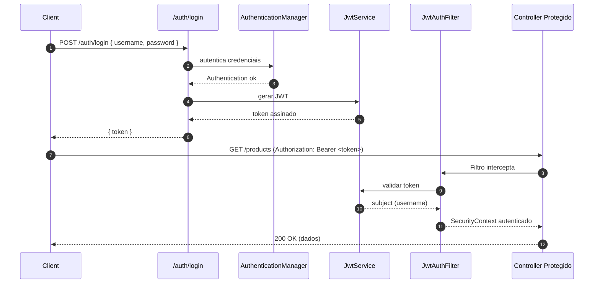

# Spring JWT — Exemplo didático (Sem Resource Server)

> **Propósito**: este repositório serve como **tutorial mínimo** para autenticação com **JWT** no **Spring Boot 3 / Spring Security 6**, sem usar o *OAuth2 Resource Server*.  
> A ideia é mostrar, com código direto, **como emitir um token** no login e **como validá-lo** em cada requisição via **filtro customizado**.

---

## Sumário
- [Arquitetura e Fluxo](#arquitetura-e-fluxo)
- [Responsabilidade das Classes](#responsabilidade-das-classes)
- [Como rodar](#como-rodar)
- [Configuração de banco (H2 em arquivo)](#configuração-de-banco-h2-em-arquivo)
- [Endpoints](#endpoints)
- [Testes rápidos (cURL)](#testes-rápidos-curl)
- [Boas práticas e notas de segurança](#boas-práticas-e-notas-de-segurança)
- [Solução de problemas comuns](#solução-de-problemas-comuns)
- [Licença](#licença)

---

## Arquitetura e Fluxo

### Visão geral
Autenticação **stateless** via JWT:
1. **/auth/login** recebe `username` e `password`.
2. O Spring autentica as credenciais (`AuthenticationManager` / `UserDetailsService`).  
3. Geramos um **JWT** com o **subject** = `username` e uma **expiração** curta.
4. O cliente envia o token nas próximas requisições no header:
   ```http
   Authorization: Bearer <token>
   ```
5. Um **filtro** (`OncePerRequestFilter`) lê o header, **valida** o token e popula o `SecurityContext`.
6. Controladores protegidos recebem a requisição **já autenticada**.

### Diagrama (Mermaid)


---

## Responsabilidade das Classes

### 🔐 `SecurityConfigurations`
- Configura o **Spring Security** no estilo moderno (sem `WebSecurityConfigurerAdapter`).
- Define a aplicação como **STATELESS**.
- **Libera** `POST /auth/login` e `POST /auth/register`; **requer** autenticação no restante.
- **Pluga** o filtro JWT na cadeia antes do `UsernamePasswordAuthenticationFilter`.
- Expõe `AuthenticationManager` e `PasswordEncoder`.

### 🧰 `JwtAuthFilter` (extends `OncePerRequestFilter`)
- Executa **uma vez por requisição**.
- Lê `Authorization: Bearer <token>`; se presente:
  - Valida com `JwtService`;
  - Carrega o usuário via `UserRepository`;
  - Cria um `UsernamePasswordAuthenticationToken` e **preenche o `SecurityContext`**.
- Se não houver token: **segue o fluxo normalmente** (quem bloqueia é a configuração de segurança).

### 🔏 `JwtService`
- Gera token com **expiração** (ex.: 1h) e assina com `SecretKey` robusta.
- Valida token e retorna o **subject** (username).

### 👤 `AuthService` (implements `UserDetailsService`)
- Integra com o Spring Security carregando usuário por `username` via `UserRepository`.

### 👤 `User` e `UserRepository`
- Entidade `User` implementa `UserDetails` e guarda `username` + `hashedPassword` (BCrypt).
- `UserRepository` fornece `findByUsername` para autenticação e o filtro.

### 🔑 `AuthController`
- `POST /auth/login`: autentica credenciais via `AuthenticationManager` e **emite JWT**.
- `POST /auth/register`: registra usuário com **BCrypt** em `hashedPassword`.

### 📦 `Product`, `ProductRepository`, `ProductController`
- Exemplo de recurso **protegido** para demonstrar o uso do token nas rotas de negócio (`/products`).

---

## Como rodar

### Pré-requisitos
- Java 17+
- Maven ou Gradle

### Passos
1. **Copie** o `application.yml` fornecido abaixo (ou baixe) para `src/main/resources/application.yml`.
2. Configure o **segredo** do JWT em `JwtService` com **32+ bytes**.
3. Rode o projeto: `./mvnw spring-boot:run` **ou** `./gradlew bootRun`.
4. (Opcional) Acesse o **console do H2** em `http://localhost:8080/h2-console` (veja credenciais na seção H2).

---

## Configuração de banco (H2 em arquivo)

Este exemplo usa **H2 file-based** (persistência em arquivo local `./data/demo`).  
Coloque este conteúdo em `src/main/resources/application.yml`:

```yaml
spring:
  application:
    name: spring-jwt
  datasource:
    url: jdbc:h2:file:./data/demo;MODE=PostgreSQL;DATABASE_TO_LOWER=TRUE;DEFAULT_NULL_ORDERING=HIGH;DB_CLOSE_DELAY=-1;
    driver-class-name: org.h2.Driver
    username: sa
    password: password
  jpa:
    hibernate:
      ddl-auto: update
    database-platform: org.hibernate.dialect.H2Dialect
  h2:
    console:
      enabled: true
      path: /h2-console

logging:
  level:
    root: INFO
    org.springframework.security: DEBUG
```

### Acesso ao H2 Console
- URL do console: `http://localhost:8080/h2-console`
- **JDBC URL**: `jdbc:h2:file:./data/demo`
- **Usuário**: `sa`
- **Senha**: `password`

> Observação: `ddl-auto: update` fará o Hibernate criar/alterar as tabelas automaticamente baseado nas entidades.

---

## Endpoints

| Método | Caminho            | Autenticação | Descrição                          |
|-------:|--------------------|--------------|------------------------------------|
| POST   | `/auth/login`      | ❌           | Autentica e **retorna JWT**        |
| POST   | `/auth/register`   | ❌           | Registra novo usuário (BCrypt)     |
| GET    | `/products`        | ✅           | Lista produtos (exemplo protegido) |
| POST   | `/products`        | ✅           | Cria produto (exemplo protegido)   |

**Formato de resposta do login**
```json
{ "token": "<jwt>" }
```

---

## Testes rápidos (cURL)

**1) Registrar usuário**
```bash
curl -X POST http://localhost:8080/auth/register \
  -H "Content-Type: application/json" \
  -d '{"username":"alice","password":"123456"}' -i
```

**2) Login**
```bash
curl -X POST http://localhost:8080/auth/login \
  -H "Content-Type: application/json" \
  -d '{"username":"alice","password":"123456"}'
# → pegue o token do JSON de resposta
```

**3) Acessar rota protegida**
```bash
TOKEN="<cole-o-token>"
curl http://localhost:8080/products \
  -H "Authorization: Bearer $TOKEN"
```

---

## Boas práticas e notas de segurança
- **Expiração curta** para o *access token* (ex.: 10–15 min).  
- **Nunca** coloque **dados sensíveis** no payload do JWT (é legível).  
- Segredo com **entropia suficiente** (≥ 32 bytes) e **fora do repositório** (variáveis de ambiente / Secret Manager).  
- Em produção, considere **refresh tokens** (idealmente em **cookie HttpOnly + Secure + SameSite**) e **rotação de chaves**.
- Valide algoritmos/claims e trate exceções com respostas JSON consistentes.

---

## Solução de problemas comuns

- **403 no `/auth/login`**  
  - Garanta que o `JwtAuthFilter` **ignore** `/auth/login` (ex.: `shouldNotFilter`).  
  - Se o cliente for web, permita **CORS** e **OPTIONS (preflight)**.  
  - Confirme o path correto: `@RequestMapping("auth")` + `@PostMapping("/login")` → `/auth/login`.

- **401 nas rotas protegidas**  
  - Verifique se o header está no formato `Authorization: Bearer <token>`.  
  - Valide expiração/segredo do JWT.

- **Senha não confere**  
  - Use `BCryptPasswordEncoder` e não compare hash com texto puro.  
  - Certifique-se de que o `UserDetailsService` está ativo e que `AuthenticationManager` o está usando.

---

## Licença
Este projeto é disponibilizado apenas para **fins educacionais**. Use por sua conta e risco.
